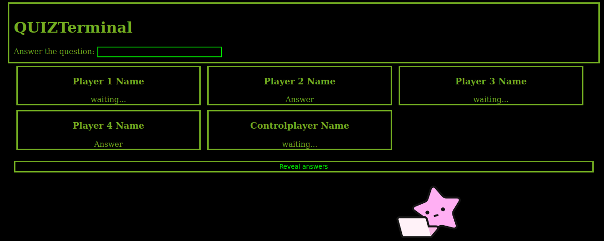

### Welcome to QUIZTerm

QUIZTerm is a simple online "quiz answering" game. It provides a way for contestants to provide answers to questions,
and reveal the answers for everyone at the same time.

Cards showing who are playing, their answer status (have they answered or not?), and when revealed, what their answer
was, will show up on everyones screen.

Not quite finished yet, it is at a point where it is "usable" enough.

There are two endpoints to use:
| / |endpoint for "regular" players.
| /control | endpoint for person controlling the quiz. Same interface as for regular players, but with possiblity to control when to reveal answers and when to move on to next question. This gives the possiblity for the person asking the question to also provide answers, but the controls will work even if there is no player joined from this page.

Next steps are:
- Display questions. Currently, Quizterm only asks user to provide answer, the actual question needs to be asked
elsewhere. This is often not a problem, since questions are asked on site, or in streamed meetings.
- Make it a little harder to join a quiz. So far, a quiz is open, and anyone that knows the URL can easily join.
A good idea to deploy to a disposable URL.
- Bad handling of players with the same name. If a player register with a name that is already in used, two players
will "compete" about being this player. You need to make sure to register with a different name than those already in
use. As all "in use" names are displayed on your screen, this is somewhat doable.
