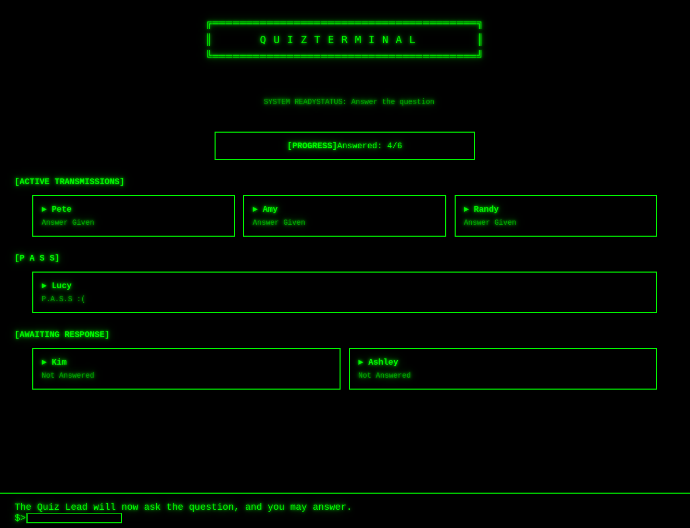
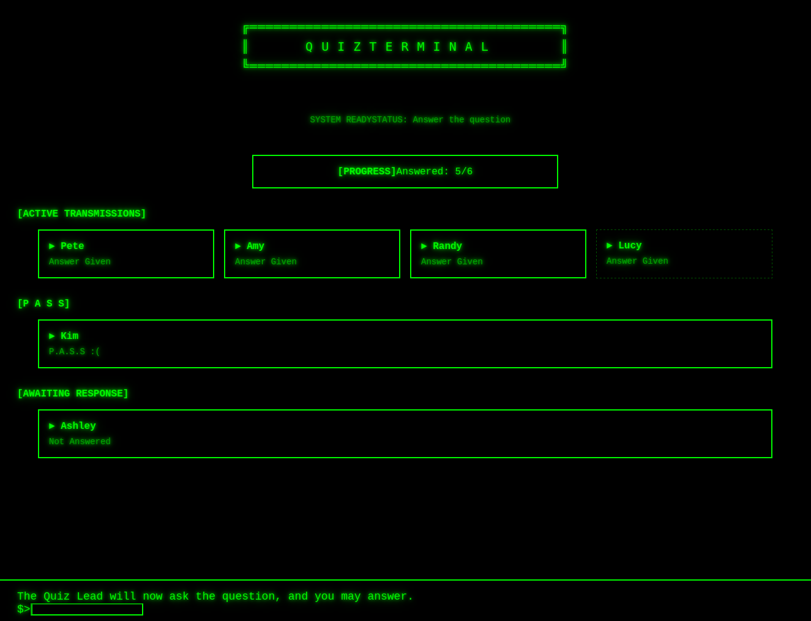

### Welcome to QUIZTerm

QUIZTerm is a simple online "quiz answering" game. It provides a way for contestants to provide answers to questions,
and reveal the answers for everyone at the same time.

Cards showing who are playing, their answer status (have they answered or not?), and when revealed, what their answer
was, will show up on everyones screen.

Not quite finished yet, it is at a point where it is "usable" enough.

Endpoints explained

| Endpoint                 | Usage                                                        |
|--------------------------|--------------------------------------------------------------|
| /room/<room_id>          | Create room with given room_id (max 200 rooms)               |
| /board/<room_id>         | Join a game with the given room_id                           |
| /board/<room_id>/control | Join a game with the given room_id with more control options |


| Ingame example           | Idle player              |
|--------------------------|--------------------------|
|  |  |

### Building and running

Docker, or a compatible container manager, like podman, is required to build and run
quizterm. The alternative is to install Gleam and Erlang/BEAM and run it dockerless.
Unless you plan to do Gleam development, using Docker will save a lot of hassle.

To compile project and build docker image, write:
```
docker build . -t quizterm:1
```
quizterm can be whatever name you want to give the container, 1 can be 
changed to whatever you want the version of the container to be.

Start server on port 4321:
```
docker run -p 4321:1234 quizterm:1
```

Port 1234 is the port used internally in the docker container, while 4321
is the port exposed outside the container. The latter can be set to whatever
port you want to use.

Open web browser and access http://localhost:4321
